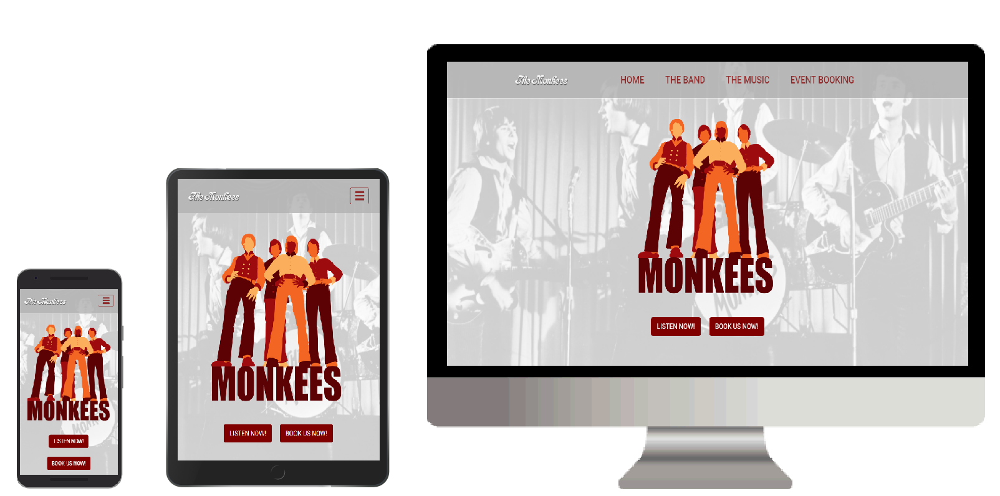

# The Monkees Website

The Monkees are a 1960’s rock band who have recently celebrated their 50 year anniversary. 
They are world renowned musicians who have vast experience of performing at live events throughout 
the globe and have built up huge legions of fans during their time at the top.

This website has been created to help publicise the band further and to help showcase their music. 
Its primary target is current and potential fans of “The Monkees” and is a place where they can 
hear and see all of their greatest music and memories. 

Some of its key features include:

*	Users can listen to the bands current greatest hits and new material will be made available when it is released,
*	Music videos can be viewed,
*	Links are available to purchase past albums,
*	All the band's latest news is available,
*	Photos of the band throughout their 50 years,
*	Information on all band members,
*	Details of all up-coming events and links to purchase tickets,
*	Users can sign up to The Monkees newsletter,
*	Access to official Facebook, Twitter and YouTube pages is easily accessible via social links,
*	The Monkees can be contacted about booking for future events via the Event Booking page,
*	The website is responsive and can be easily accessed and viewed on any device i.e. mobile, tablet or desktop.

## The Website:

### Deployment:

This website is hosted by GitHub pages and can be viewed at: 
[https://shanecoen.github.io/the-monkees-project/index.html](https://shanecoen.github.io/the-monkees-project/index.html)

### Responsively Designed:

This website has been designed Mobile first as priority and huge importance has put into this area to ensure that
it functions responsively on all devices be it mobile, tablet and desktop screen sizes.

The bootstrap framework was used extensively to give the website a highly responsive layout.

### UX Design:

It was designed using the 5 principles of UX Design (strategy, scope, structure, skeleton and surface) in order to develop
a website that fully met the user's needs.

### Semantic HTML:

Wherever possible Semantic HTML5 elements were used in order to have the HTML code structured correctly.

### Technologies Used:

* Bootstrap 4.0 (note: all features of the Bootstrap framework that were utilised throughout this project were modified with my
own styles in order to meet my requirements).
* HTML5
* CSS3

### Features And Functionality:

#### Common To All Pages:

* Navbar

Bootstrap was used to create the Navbar that is used and is common to all pages in this website. It is fixed and is visible at all times.
It has an opacity of 0.8 therefore the background is always slightly visible behind it. It responds to all screen sizes and produces a collapsible 
navbar menu on smaller mobile and tablet screen sizes. The image below show the navbar in tablet screen size with the menu collapsed and the 
collapsed menu open.

* Jumbotron

Each page makes use of the Bootstrap Jumbotron feature with each containing a background image and logo.

* Footer

The footer is also common to all pages. It gives quick access to The Monkees social media pages i.e. Facebook, Twitter and YouTube. It also
allows users to sign up to the newsletter which gives unique access to all The Monkees latest news and info.

#### Homepage (index.html):

* Picture Slider

The homepage displays a picture slider feature. It makes use of the Bootstrap Carousel and is placed behind a picture frame image which is used
to help display famous memories of The Monkees. The images change automatically and no navigation controls are present. 

* News Reel

The Bootstrap Carousel was again used for this feature but it was edited and was transformed into a news reel showing all the latest
news. These news reel items feature Headings, images and text and a video and audio file. The user can navigate between each item using the
next and previous icons, they also change automatically after 10 seconds or will pause when the user hovers over them.

* Up-Coming Events

For this section the Bootstrap "Card" feature was utilised. Each up-coming event features an image along with date and a venue. Each event
also comes with a link to purchase individual event tickets.

#### The Band (band.html):

* Video files

There are two video files displayed in this page (music video and The Monkees TV episode). Each is embedded from YouTube using Bootstrap's
responsive <iframe> feature. Bootstrap comes with customisable aspect ratios to ensure the embedded video file is responsive
to the device type being used.

* Image Slider

This page again makes use of Bootstrap carousel feature in order to give an introduction to the four band members and also to show
a number of images of the band. There are no navigation controls and each slide will change automatically after 3 seconds. This slider
is hidden on smaller mobile screen sizes.

* Meet The Monkees

This feature uses the Bootstrap card component and the collapsible accordion (modified using my own styles).  Each collapsible card is used to feature one individual
member of the band (includes four in total) and features the members name and an image. Once the card is clicked it opens to reveal information
and another image of the band member. When one card is opened it automatically closes any previous card that had been opened (image below shows
card unopened (left) and opened (right).

#### The Music (music.html):

* Audio And Video Files

This page allows the user to listen to some of The Monkees greatest hits via Audio Files. The files are laid out using Bootstraps list group and
each file comes wth controls to play, pause, download (depending on browser) and adjust sound. A link is included which allows users to purchase 
the album that these audio files come from.

The three music video files included are similar to the band.html and use Bootstraps responsive <iframe> embedded videos.

* Albums

This section uses the Bootstrap "Card" feature. A list of The Monkees past albums featuring an image, album title and a link to purchase is
included. These albums covers are responsive and react to individual device sizes.

#### Event Booking (contact.html):

* Event Booking Form

This page allows the user to contact The Monkees with regard to making a future booking for events such as birthdays, anniversaries and larger 
events such music venues and festivals. It makes use of Bootstraps form-group and uses labels and inputs (including select fields and radio
buttons). The image below show the event booking form in both mobile (left) and desktop view (right).

### Testing:

This website was tested at every single stage to ensure that it responded correctly to every device type. Some of the device
types used for testing included; Lenovo IdeaPad 100 laptop, Samsung Galaxy 7 Inch Tablet, Amazon Fire 6 Inch Tablet, Apple iPad 9.7 Inch,
and a number of mobile phone brands such as Apple iPhone, samsung and Huawei. Media Queries were used where required to ensure that 
every aspect responded as desired with regard to image size, layout, positioning etc.

It was tested using various browsers i.e. Google Chrome, Microsoft Edge and Mozilla Firefox etc. utilising available tools such as 
Chrome's dev tools and Firefox's Responsive design mode. The site could then be inspected as it was being worked on and any changes being made to the site were constantly
being monitored to see how the different browsers and screen sizes would be affected. Using all these available tools I was able to
ensure my website functioned correctly and is responsive as possible on all device sizes. The image below shows how this responsive design
mode tool was utilised to show the website on various device types and brands.

All HTML and CSS code was run through W3C validators to ensure that all code written is valid and to make sure that it complies with the 
standards set by the W3 Consortium.

### Author:

Shane Coen (This project is part of Code Institute's Online mentored Software Development  course and was completed in March 2018).