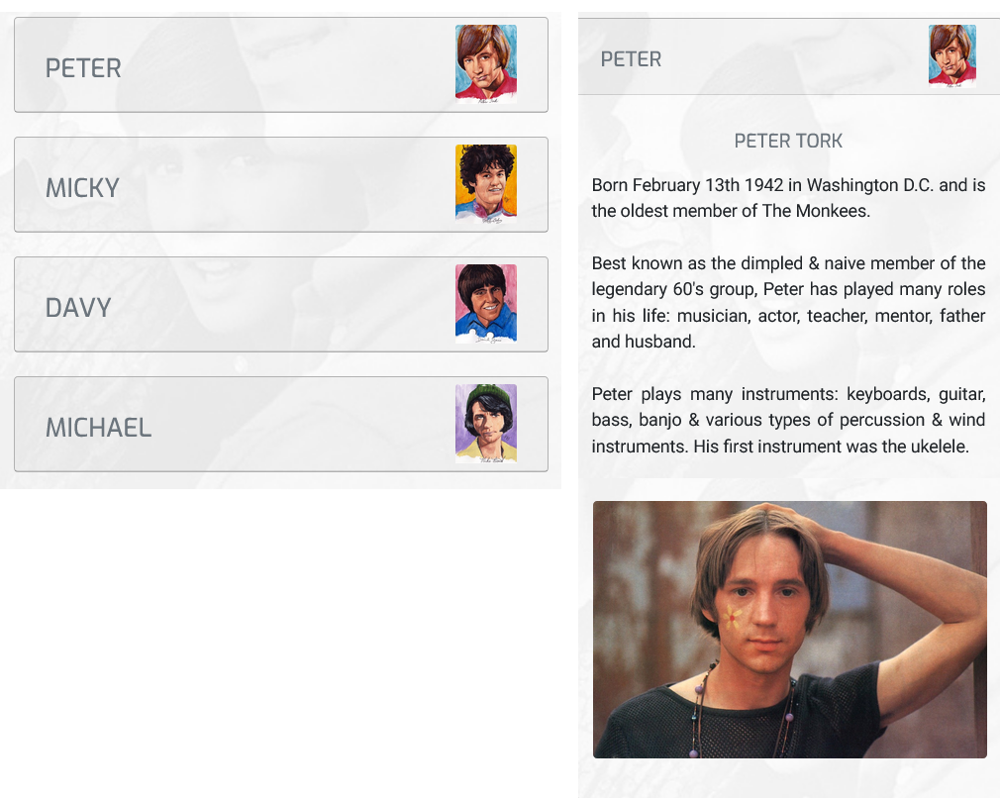

# The Monkees Website

### Who is this website for?

The monkees are a 1960’s rock band who have recently begun celebrating their 50 year anniversary. 
They are world renowned performers who have vast experience of performing at live events throughout 
the globe and have built up huge legions of fans throughout their time at the top.

### What needs does it fulfill?

This website has been created to help publicise the band further and to help showcase their music. 
Its primary target is current and potential fans of “The Monkees” and is a place where they can 
hear and see all of their greatest memories. 

Some of its key features include:

*	Users can listen to the bands current greatest hits and new material will be made available when it is released.
*	Music videos can be viewed.
*	Links are available to purchase past albums.
*	All the bands latest news is available.
*	Photos of the band throughout their 50 years.
*	Information on all band members.
*	Details of all up-coming events and links to purchase tickets.
*	Users can sign up to The Monkees newsletter.
*	Fast access to official Facebook, Twitter and YouTube pages are easily accessible.
*	The Monkees can be contacted about booking for future events via the Event Booking page.
*	The website is responsive and can be easily accessed and viewed on any device i.e. mobile, tablet or desktop.

### Where can the website be viewed?

This website is hosted by GitHub pages and can be viewed at: 
[https://shanecoen.github.io/the-monkees-project/index.html](https://shanecoen.github.io/the-monkees-project/index.html)

## The Website:

### Responsively Designed:

This website has been designed Mobile first as priority and huge importance has put into this area to ensure that
it functions responsivelly on all devices be it mobile, tablet and desktop screen sizes.

The bootstrap framework was used extensivelly to give the website a highly responsive layout.

The website was tested at every single stage to ensure that it responded correctly to every device type. Media Queries
were used where required to ensure that every aspect responded as desired with regard to image size, layout, positioning etc.

### Technologies Used & Functionality:

#### Common To All Pages:

* Navbar

Boostrap was used to create the Navbar that is used and is common to all pages in this website (It has been modified using my own styles).
It responds to all screen sizes and produces a collapsible navbar menu on smaller mobile and tablet screen sizes. The image below show the navbar 
in tablet screen size with the menu collapsed and the collpased menu open.

* Jumbotron

Each page makes use of the Bootstrap Jumbotron feature with each containing a background image and logo.

* Footer

The footer is also common to all pages. It gives quick access to The Monkees social media pages i.e. Facebook, Twitter and YouTube. It also
allows users to sign up to the newsletter which gives unique access to all The Monkees latest news and info.

#### Homepage (index.html):

* Picture Slider

The homepage displays a picture slider feature. Its makes use of the Bootstrap Caraosel and is placed behind a picture frame image which is used
to help display famous memories of The Monkees. The images slide automitically and no navigation controls are present. 

* News Reel

The Bootstrap Carousel was again used for this feature but it was edited and was transformed into a news reel showing all the latest
news. These news reel items feature Headings, images and text and a video and audio file. The user can naviagte between each item using the
next and previous icons, they also change automitically after 10 seconds or will pause when the user hovers over them.

* Up-Coming Events

For this section the Bootstrap "Card" feature was utilised. Each up-coming event features an image along with date and a venue. Each date
also comes with a link to purchase individual event tickets.

#### The Band (band.html):

* Video files

There are two video files displayed in this page (music video and The Monkees TV episode). Each is embedded from YouTube using Bootstrap's
responsive <iframe> feature. Bootstrap comes with customisbale aspect ratios to ensure the embedded video file is responsive
to the device type being used.

* Image Slider

This page again makes use of Bootstrap carousel feature to allows the user to naviagte through a number of images of the band. Navigation is 
allowed via the use of the next and previous icons (images will also change automitically).

* Meet The Monkees

This feature uses the Boostrap card component and the collapsible accordian.  Each collapsible card is used to feature one individual
member of the band (includes four in total) and features the members name and an image. Once the card is clicked it opens to reveal information
and another image of the band member. When one card is opened it automitically closes any previoud card that had been opened.

#### The Music (music.html):

